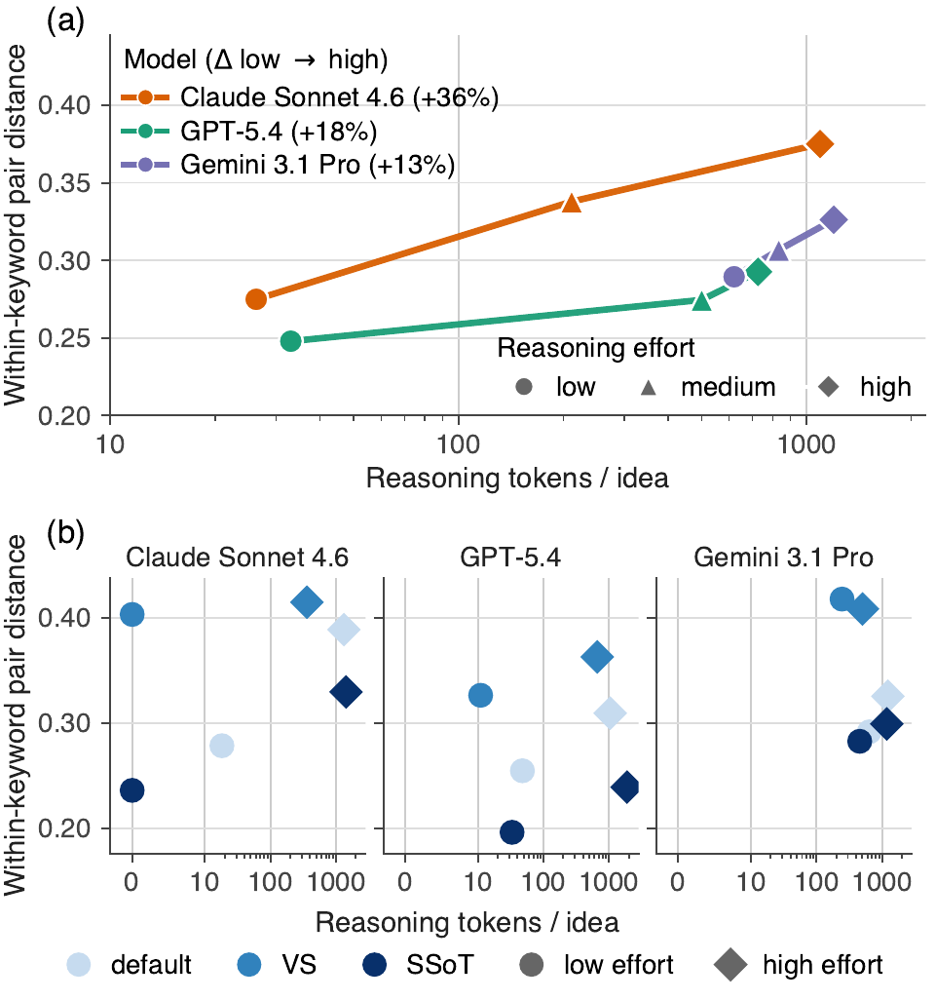

# On the Effects of Reasoning Effort and Prompt-Based Diversification on Scientific Ideation Diversity

**Venue:** Discovery Science 2026, poster.

**Full version:** An extended version with additional appendices appeared at
the ICML 2026 AI for Science workshop: <https://icml.cc/virtual/2026/73442>

**Repository:** [github.com/bioinfo-tsukuba/scientific-ideation-diversity](https://github.com/bioinfo-tsukuba/scientific-ideation-diversity)

## Abstract

> Frontier large language models (LLMs) performing extended chain-of-thought reasoning have advanced closed-ended task performance, motivating interest in AI Scientist systems that automate stages of the research pipeline. In such systems, scientific ideation matters as the most upstream stage, where the diversity of generated research ideas bounds the downstream search space. While reasoning effort improves closed-ended task accuracy, its effect on open-ended scientific ideation diversity has not been systematically measured. We generate over 300,000 ideas across three frontier LLMs (Claude Sonnet 4.6, GPT-5.4, Gemini 3.1 Pro), three reasoning-effort levels (low, medium, high), and the LiveIdeaBench keyword set, and evaluate diversity with lexical metrics, embedding-based metrics across three embedders, and a pairwise LLM-as-a-Judge rubric across two judge models (about 1,400,000 pairwise judgments). For comparison, we additionally evaluate two prompt-based diversification methods, Verbalized Sampling and String Seed of Thought, at the low and high reasoning-effort levels. Three main findings emerge. (1) Increasing reasoning effort raises within-keyword embedding pair distance by 13–36% from low to high, with only small changes in LLM-judged originality, feasibility, and clarity. (2) Verbalized Sampling at low effort matches or exceeds default-prompt high-effort embedding diversity on quartile-defined keyword subsets, while using 80–100% fewer reasoning tokens per idea, with no substantial decline in judged quality. (3) In embedding space, idea distributions produced by varying reasoning effort and by varying prompt are nearest-neighbor distinguishable across all model, embedder, and keyword-subset combinations. These results are consistent across embedders and judges, providing a large-scale empirical map of how reasoning effort and prompt-based diversification shift open-ended scientific-ideation diversity.

## Main result

<p align="center"></p>

**(a)** Raising reasoning effort from `low` to `high` increases within-keyword
embedding pair distance by 13–36% in all three models (default prompt, full
LiveIdeaBench). **(b)** Verbalized Sampling (VS) at `low` effort matches or exceeds
default-prompt `high`-effort pair distance while using 80–100% fewer reasoning
tokens per idea ($Q_1 \cup Q_4$ keyword subsets; symlog *x*-axis). Both panels use
text-embedding-3-large. This is Fig. 1 of the paper.

## What is in this repository

This repository contains the **code** for the paper: the generation pipeline,
the embedding / lexical / LLM-judge evaluation stages, and the analysis and
figure scripts. It deliberately contains **no large data**. The raw generations,
judge logs, and embeddings are released separately as a dataset (see below).

## Dataset

The accompanying dataset (raw generations, LLM-judge logs, and embeddings) is
hosted on Hugging Face, released under the CC BY 4.0 license:

<https://huggingface.co/datasets/tax-free/scientific-ideation-diversity>

Analysis scripts expect the dataset to be materialised under `results/` at the
repository root (`results/` is git-ignored). `tools/package_hf_dataset.py` is the
release-side script used to build the dataset archive; `tools/materialize_hf_dataset.py`
is its inverse, used to reconstruct that `results/` tree from a downloaded copy
of the dataset (see "Reproducing the paper" below).

## Install

```bash
uv sync
```

Scripts are run from the repository root so that `src/` resolves as a package:

```bash
uv run python scripts/experiment/diversity/compute_vendi_score.py
```

## Repository layout

| Path | Contents |
| --- | --- |
| `src/` | Library code: provider backends (LLM generation, LLM judges, embedders), pydantic schemas, metrics, artifact I/O, model registry. |
| `scripts/` | Pipeline entry points: generation (`run_diversity_experiment.py`), lexical diversity, facet diversity, and per-stage experiment scripts under `scripts/experiment/`. |
| `scripts/figures/` | Analysis and figure/table scripts that produce the paper's figures and tables. |
| `prompts/` | Prompt templates: the facet idea-generation prompt, the two diversification prompts (VS, SSoT), and the two vendored LiveIdeaBench judge prompts. |
| `data/` | Small committed inputs: the stratified LiveIdeaBench keyword subsets and the benchmark provenance manifest. |
| `tools/` | Release tooling (not part of the research pipeline), e.g. Hugging Face dataset packaging. |

See [REPRODUCING.md](REPRODUCING.md) for the mapping from each paper item
(figure / table / reported statistic) to the script that produces it.

## Reproducing the paper

**Status:** the end-to-end reproduction pipeline (raw data → all figures) is
being verified; please open an issue if a step fails.

1. **Download the dataset** from Hugging Face (see [Dataset](#dataset) above)
   into a local directory, e.g. `./hf_dataset_out` — the same layout
   `tools/package_hf_dataset.py` produces.
2. **Materialize it into the internal layout** the analysis scripts expect,
   under `results/effort_diversity/`:

   ```bash
   uv run python tools/materialize_hf_dataset.py --dataset-dir ./hf_dataset_out --no-dry-run
   ```

   (Omit `--no-dry-run` first to preview the file plan; nothing is written
   until you pass it.)
3. **Follow [REPRODUCING.md](REPRODUCING.md)**: run its "Stage 0" table top to
   bottom to rebuild every intermediate CSV the figure/table scripts need
   from the raw dataset, then run the per-item rows for the specific
   figure/table/statistic you want to reproduce. The `scripts/figures/`
   scripts write their figures and tables under `outputs/` at the
   repository root (`outputs/figures/`, `outputs/tables/`; git-ignored).

## License

This repository is released under the MIT License — see [LICENSE](LICENSE).

Some files are derived from third-party material (LiveIdeaBench) and carry their
own attribution — see [NOTICE.md](NOTICE.md).

## Citation

Page numbers and DOI will be added once the DS 2026 proceedings are published.

```bibtex
@inproceedings{chinen2026ideationdiversity,
  title     = {On the Effects of Reasoning Effort and Prompt-Based Diversification
               on Scientific Ideation Diversity},
  author    = {Chinen, Yu and Ozaki, Haruka},
  booktitle = {Discovery Science: 29th International Conference, DS 2026,
               Mainz, Germany, October 5--9, 2026, Proceedings},
  series    = {Lecture Notes in Computer Science},
  publisher = {Springer},
  year      = {2026},
}
```
